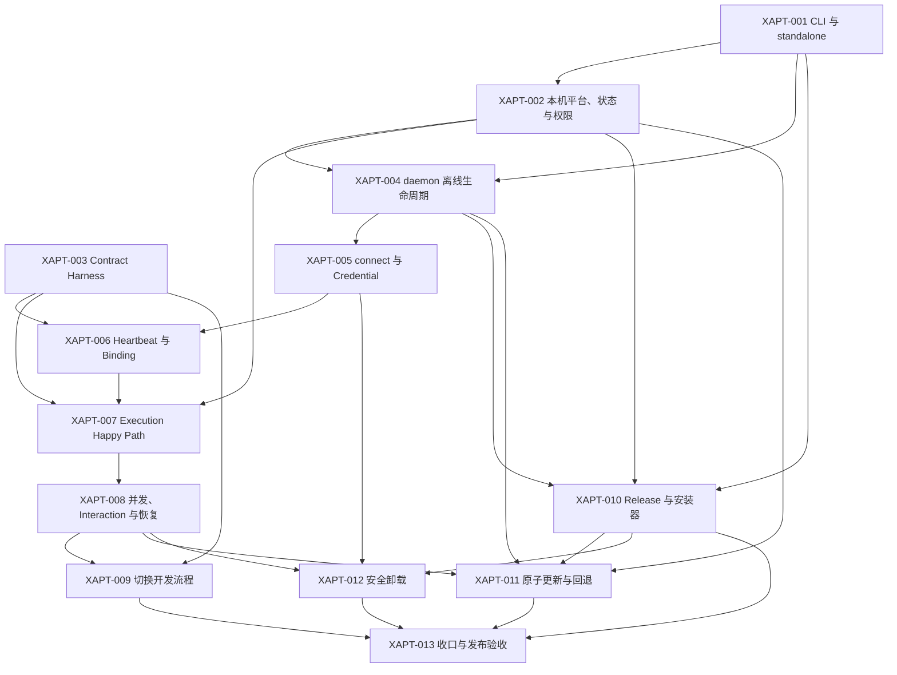

# xapt 0.x 实施 Tickets

本目录将 [`../spec.md`](../spec.md) 拆成 13 个可独立演示或验证的纵向切片。实施遵循 expand → migrate → contract：先建立 xapt 与协议测试 Seam，再迁移连接和执行能力，最后删除旧 Runner。

## 状态

| Ticket                                                              | 用户结果                               | Blocked by                             | 初始状态        |
| ------------------------------------------------------------------- | -------------------------------------- | -------------------------------------- | --------------- |
| [XAPT-001](XAPT-001-app-cli-and-standalone.md)                      | xapt 应用、公共 CLI 与 standalone 产物 | 无                                     | ready-for-agent |
| [XAPT-002](XAPT-002-local-platform-state-and-permissions.md)        | 本机路径、权限、状态和平台 Adapter     | XAPT-001                               | blocked         |
| [XAPT-003](XAPT-003-runner-contract-conformance-harness.md)         | 跨应用 Contract Conformance Harness    | 无                                     | ready-for-agent |
| [XAPT-004](XAPT-004-disconnected-daemon-lifecycle.md)               | 未连接 daemon 的 start/status/stop     | XAPT-001、XAPT-002                     | blocked         |
| [XAPT-005](XAPT-005-daemon-connect-and-credential-ownership.md)     | daemon connect 与 Keychain Credential  | XAPT-004                               | blocked         |
| [XAPT-006](XAPT-006-heartbeat-binding-and-local-repositories.md)    | Heartbeat、Binding 与本机仓库映射      | XAPT-003、XAPT-005                     | blocked         |
| [XAPT-007](XAPT-007-real-execution-happy-path.md)                   | 单条真实 Codex Execution Happy Path    | XAPT-002、XAPT-003、XAPT-006           | blocked         |
| [XAPT-008](XAPT-008-concurrency-interactions-and-recovery.md)       | 三槽并发、Interaction、Outbox 与恢复   | XAPT-007                               | blocked         |
| [XAPT-009](XAPT-009-switch-development-workflow-to-xapt.md)         | 仓库开发流程切换到 xapt                | XAPT-003、XAPT-008                     | blocked         |
| [XAPT-010](XAPT-010-release-artifacts-and-installer.md)             | Release 资产与 curl 安装器             | XAPT-001、XAPT-002、XAPT-004           | blocked         |
| [XAPT-011](XAPT-011-atomic-update-and-rollback.md)                  | 原子更新、Schema 安全和自动回退        | XAPT-002、XAPT-004、XAPT-008、XAPT-010 | blocked         |
| [XAPT-012](XAPT-012-safe-uninstall-and-agent-revocation.md)         | 安全卸载与 Agent 自撤销                | XAPT-005、XAPT-008、XAPT-010           | blocked         |
| [XAPT-013](XAPT-013-remove-legacy-runner-and-release-acceptance.md) | 删除旧 Runner 并完成发布验收           | XAPT-009 至 XAPT-012                   | blocked         |

## Blocking edges

## 实施规则

- 每个 Ticket 在独立上下文中实施，并以本文件声明的 blocking edges 判断是否可抓取。
- 每个 Ticket 必须交付可运行的纵向结果，不按目录或类机械拆分。
- 修改任何函数、类或方法前先执行 GitNexus upstream impact；HIGH 或 CRITICAL 风险先报告。
- Ticket 完成前运行匹配的测试、类型检查和格式检查，并执行 GitNexus `detect_changes`。
- 不为过渡期添加旧 Home、旧 CLI、旧 Schema 或旧包的长期兼容层。
- XAPT-013 完成后删除本 Spec 和 Tickets；长期结论保留在 ADR、CONTEXT、README、测试和代码规则中。
